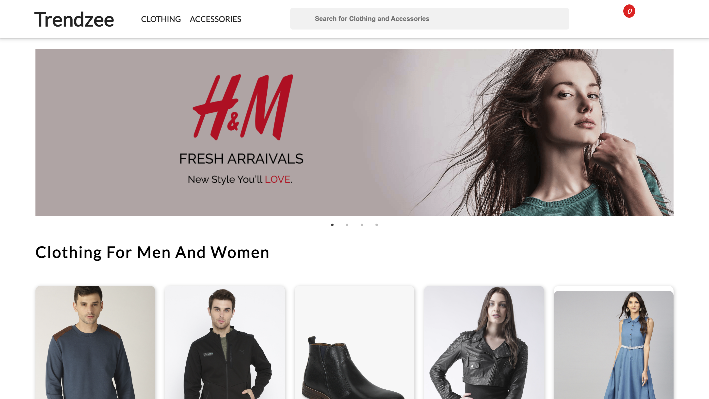

# 🛍️ Trendzee – E-Commerce Website

**Trendzee** is a modern and responsive e-commerce website designed to showcase fashion products like clothing and accessories. It features modular HTML components, a stylish product slider, and clean, minimal UI — ideal for learning and demonstrating front-end development skills.

---

## 📸 Preview --

---

## 🚀 Features

- 🔗 Modular component structure (`header.html`, `content.html`, `footer.html`)
- 🎞️ Integrated Slick Carousel for sliders
- 🧥 Product listing pages: Clothing and Accessories
- 💻 Responsive design with clean CSS
- 🧠 JavaScript interactivity (e.g., "Add to Cart" feedback)
- 🎨 Uses Google Fonts & FontAwesome icons

---

## 🛠️ Tech Stack

- **HTML5 / CSS3**
- **JavaScript (Vanilla + jQuery)**
- **Slick Carousel**
- **Google Fonts**
- **FontAwesome**

---
